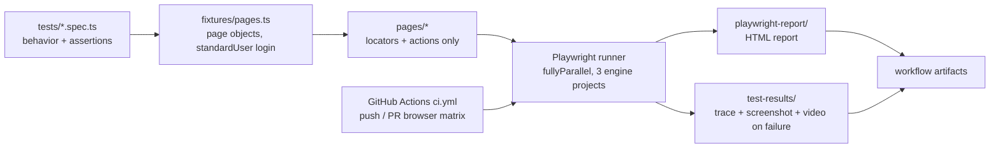

# QA-as-Code Starter

A clone-and-go Playwright + TypeScript starter template that wires a Page Object Model suite, a three-browser GitHub Actions pipeline, and HTML reporting into one small repo — for QA engineers who need to demonstrate pipeline competency, or teams that want a same-day starting point for web E2E testing.

[](https://github.com/Yvneif/QA-as-Code-Starter/actions/workflows/ci.yml)

## Install

Requires Node.js 18+ (tested on 22).

```bash
git clone https://github.com/Yvneif/QA-as-Code-Starter.git
cd QA-as-Code-Starter
npm install   # postinstall also downloads the Chromium, Firefox, and WebKit engines
```

## Quickstart

```bash
npx playwright test
```

That's it — the suite targets [saucedemo.com](https://www.saucedemo.com) (a public demo store) and runs 5 tests across all three browser engines, in parallel, in well under a minute. No `.env` is required; safe demo defaults are built in.

Expected output:

```
  15 passed (20s)
```

Open the HTML report afterwards:

```bash
npm run report
```

## Usage

```bash
npx playwright test --project=chromium   # a single browser engine
npm run test:headed                      # watch the browser while tests run
npm run test:ui                          # Playwright UI mode (time-travel debugging)
npm run report                           # open the last HTML report
npm run lint                             # ESLint
npm run format                           # Prettier (write) — format:check for CI-style check
```

## Configuration

Copy `.env.example` to `.env` to override defaults locally — `.env` is gitignored and never committed. In CI, feed these through [repository secrets](https://docs.github.com/en/actions/security-for-github-actions/security-guides/using-secrets-in-github-actions) instead; the workflow references them with a public-demo fallback.

| Variable | Default | Purpose |
| --- | --- | --- |
| `BASE_URL` | `https://www.saucedemo.com` | Application under test. Point it elsewhere to retarget the whole suite. |
| `DEMO_USERNAME` | `standard_user` | Login for the happy-path tests. |
| `DEMO_PASSWORD` | `secret_sauce` | Password for the demo account. |
| `DEMO_LOCKED_USERNAME` | `locked_out_user` | Used by the negative login test. |
| `DEMO_LOCKED_PASSWORD` | `secret_sauce` | Password for the locked-out account. |

These credentials are published by the demo site itself, so they are not secrets. For a real application: keep real values in a secret store, never in `.env.example` or the repo.

## CI pipeline

`.github/workflows/ci.yml` runs on every push to `main` and every pull request:

- **Matrix** — the suite runs once each on Chromium, Firefox, and WebKit (`ubuntu-latest`), one job per browser, `fail-fast: false`.
- **Retries** — failed tests retry twice in CI to absorb demo-site flakiness; a test that fails all retries is a real red.
- **Artifacts** (uploaded even when tests fail, retained 14 days):
  - `playwright-report-<browser>` — the interactive HTML report.
  - `test-failure-artifacts-<browser>` — trace, screenshot, and video for every failed test (`npx playwright show-trace <file>` to replay).

To switch from cloning to owning this pipeline: create an empty repo on GitHub, push, and the badge in the header goes green on the first run.

## Architecture



```
qa-as-code-starter/
├── .github/workflows/ci.yml   # CI: push/PR, 3-browser matrix, artifacts
├── fixtures/pages.ts          # fixture wiring: page objects + standardUser login
├── pages/                     # Page Object Model (BasePage + 4 pages)
├── tests/                     # specs grouped by feature: auth, checkout, navigation
├── utils/                     # env access + central test data
├── playwright.config.ts       # parallelism, retries, failure evidence, reporters
└── .env.example               # configuration template (.env is gitignored)
```

## Writing your own tests

The conventions this template establishes:

1. **One behavior per test**, named as a sentence: `locked-out user is rejected with a clear error message` — the failure report should read like the bug ticket.
2. **Arrange–Act–Assert** stays visible in the test body; comments mark the seams.
3. **Page objects own locators and actions; tests own assertions.** Page objects never assert on behavior — they expose state (`errorMessage`, `cartBadge`) for the test to assert on.
4. **Get page objects from fixtures** (`fixtures/pages.ts`) instead of constructing them. Need a logged-in session? Request the `standardUser` fixture. The same pattern is where you'd add API-seeded state later.
5. **Test data lives in `utils/test-data.ts`**, not inline in tests.

A minimal new test:

```typescript
import { expect, test } from '../../fixtures/pages';
import { products } from '../../utils/test-data';

test('added product shows a cart badge count of one', async ({
  standardUser: _standardUser,
  inventoryPage,
}) => {
  await inventoryPage.addToCart(products.backpack);
  await expect(inventoryPage.cartBadge).toHaveText('1');
});
```

## Troubleshooting

- **`Executable doesn't exist` / browsers missing** — run `npx playwright install` (or reinstall via `npm install`).
- **WebKit on Linux fails to launch** — system libraries are missing: `npx playwright install-deps webkit`.
- **Demo site is down or slow** — the tests are written against saucedemo.com's DOM. If it misbehaves, confirm in a browser; sustained outages are the one external risk this template can't remove. To retarget, set `BASE_URL` and adapt the page objects.
- **Tests time out locally on a busy machine** — lower concurrency: `npx playwright test --workers=2`. The config already caps local workers at 4.

## Extending

Deliberately out of scope to keep the template clone-and-go: Allure reporting (the built-in HTML report covers day-one needs), API-layer test fixtures, and persistent auth states. Each drops cleanly into `fixtures/` when a project needs it.

## License

[MIT](LICENSE)
